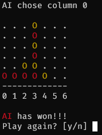
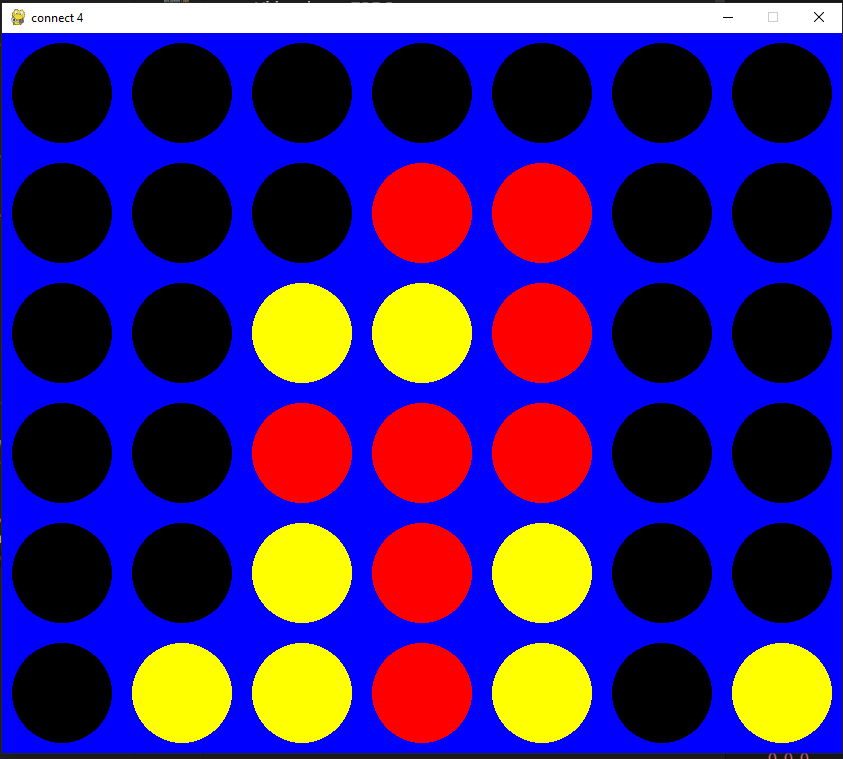

# CONNECT 4

### Video demo: https://youtu.be/qAlR-URkgmU

This is a simple game of connect 4 where you will play against an AI.
The AI uses the minimax algorithm with alpha-beta pruning for optimisation. The player who starts is randomly assigned. You can play either on the terminal or using a GUI. The GUI is coded using the pygame library.  

Ensure that you have the appropriate libraries before running the program. You can do this by running
```
pip install -r requirements.txt
```

You can play on the terminal by running `connect4.py`



You can play using the GUI by running `main.py`




## References

### Medium aritcle  
https://medium.com/analytics-vidhya/artificial-intelligence-at-play-connect-four-minimax-algorithm-explained-3b5fc32e4a4f

### Keith Galli  
Github: https://github.com/KeithGalli/Connect4-Python/blob/master/connect4_with_ai.py  
Youtube: https://www.youtube.com/watch?v=MMLtza3CZFM

### Wikipedia article  
https://en.wikipedia.org/wiki/Alpha%E2%80%93beta_pruning
https://en.wikipedia.org/wiki/Minimax

### Numberphile (extra information)
https://www.youtube.com/watch?v=yDWPi1pZ0Po